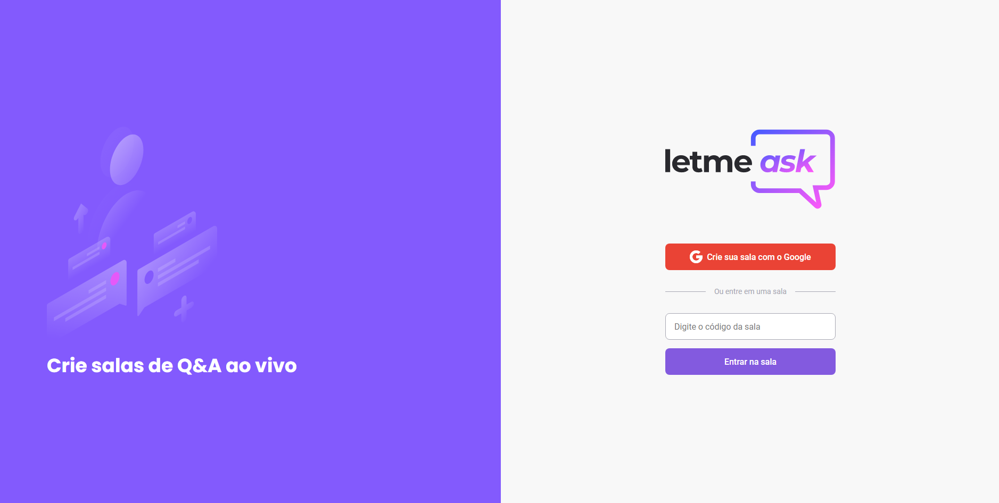

<p align="center">
   
</p>

<p align="center">
  
  
  
</p>

<p align="center">
   
</p>

---

## :pushpin: Sobre

Projeto desenvolvido durante a Next Level Week #6 da @Rocketseat. Consiste numa plataforma para gerenciar/fazer perguntas em uma determinada sala.

#### Acesse os templates no Figma:

- [Layout Web - Figma](https://www.figma.com/file/d8giPdVC2W41ZJu1yUk0dq/Letmeask)

#### Acesse a demo:

- [Letmeask - Demo](https://letmeask-kist.web.app)

## ✨ Tecnologias utilizadas

Este projeto foi desenvolvido utilizando as seguintes tecnologias:

- [ReactJS](https://reactjs.org/)
- [Typescript](https://www.typescriptlang.org/)
- [Firebase](https://firebase.google.com/?hl=pt)

## 🚀 Como rodar?

Execute os comandos no seu terminal:

```bash
# Clone o repositório
$ git clone https://github.com/evertoont/letmeask-nwl

# Entre no repositório
$ cd letmeask-nwl

# Instale as dependências
$ yarn install

# Realize a configuração do SDK do Firebase
# No arquivo .env.example
# Altere o nome do arquivo para .env.local

# Execute a aplicação
$ yarn start
```

Acesse em seu navegador http://localhost:3000/ para ver o resultado.

## 📝 Licença

Este projeto está sob a licença MIT. Veja o arquivo [LICENSE](LICENSE) para mais detalhes.

---

<p align="center">Made with 💻 by <a href="https://github.com/ksitvictor">Victor Kist</a> <br><br>
<a href="https://www.linkedin.com/in/victor-kist/">
  
</a>
</p>
